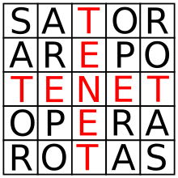

# Sator Square Generators
---
This is a mini project that creates all possible sator squares using 5 letter words in Spanish.

## What is a sator square?

The Sator Square is a two-dimensional acrostic class of word square containing a five-word Latin palindrome, like this:

As you can see in the image, it is a palindrome of 5 words of 5 letters, which can also be read vertically and in reverse. The idea was to create this type of pictures but using words of 5 letters in Spanish

## Words
At first I tried using the library ["An array of spanish words"](https://github.com/words/an-array-of-spanish-words), which contains ~636,000 words. However, it did not return any squares, so I needed more input data.
In the end, I have used the [wiktionary](https://en.wiktionary.org/) website, from which I was able to extract 27,417,111 words, organize them into an array, and separate only the 5-letter words.

## Generate the Sator square
To generate the sator square, I decided to start with the central word, this should be a palindromic word.
Then he had to find the first and last word, for this he had to find a word whose central letter is equal to the first letter of the central word. It should also be a word that, if reversed, would result in another word that is in the dictionary. So that in this way he can occupy the last place.
Finally he had to find the second and fourth words. This word has to be reversible, its central letter must be equal to the second letter of the central word and, in addition, its first and last letters must be equal to the second and fourth letters of the first word, respectively.

## Usage

### Dependencies
* [Nodejs](https://nodejs.org/es)
* [Git](https://git-scm.com)

From your command line:
```bash
# Clone this repository
$ git clone 

# Install dependencies
$ npm install

# Run the app
$ node index.js
```

## Contact

- Website [Lucas Villanueva](https://lucasvillanueva.com.ar)
- GitHub [@Lucasv7588](https://github.com/Lucasv7588)
- LinkedIn [Lucas Villanueva](https://www.linkedin.com/in/lucasvillanueva1999/)